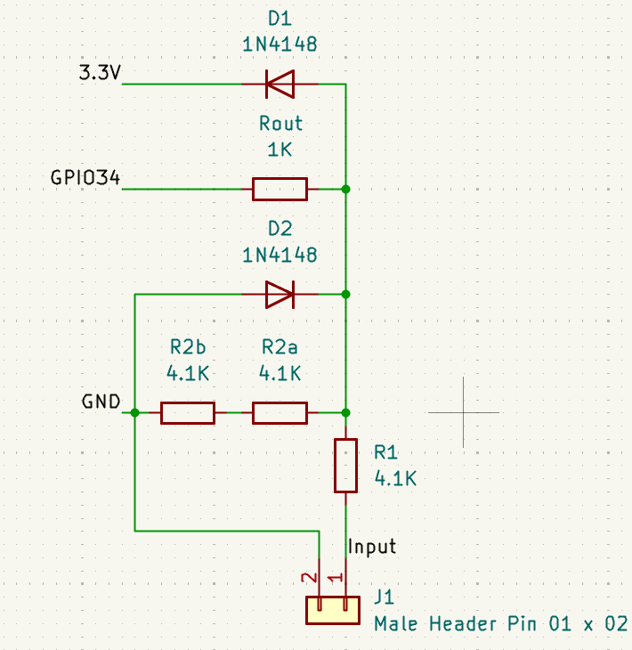

# WaveView

A real-time oscilloscope built from scratch on ESP32 with a PyQtGraph GUI.  
Sample signals at 10kHz, measure PWM, audio, and sensor outputs — all from your laptop.

---

## Features

| Feature | Details |
|---|---|
| **Sample rate** | 10,000 Sa/s (10 kHz) |
| **Input range** | 0–5V (hardware voltage divider) |
| **Resolution** | 12-bit ADC (ESP32) |
| **History** | 5 seconds of scrollable waveform history |
| **Zoom** | 7 levels (13ms → 819ms window) |
| **Auto measurements** | Vpp, Vmax, Vmin, Frequency, Period, Duty cycle |
| **Cursor measurements** | ΔT, 1/ΔT, ΔV |
| **Controls** | Pause, scroll, zoom, cursor mode |

---

## Hardware

### Components

| Component | Value | Purpose |
|---|---|---|
| ESP32 DevKit | — | ADC sampling + USB serial |
| Resistor R1 | 4.1kΩ | Voltage divider input |
| Resistor R2a + R2b | 4.1kΩ + 4.1kΩ (8.2kΩ total) | Voltage divider output |
| Resistor Rout | 1kΩ | 
| Diode D1 | 1N4148 | Clamp to 3.3V |
| Diode D2 | 1N4148 | Clamp to GND |
| Perfboard | 8×12cm | Circuit board |

### Input Protection Circuit



---

## Keyboard Controls

| Key | Action |
|---|---|
| `Space` | Pause / Resume |
| `← →` | Scroll through history (when paused) |
| `+ -` | Zoom in / out |
| `M` | Enter cursor mode (auto-pauses) |
| `1` / `2` | Select cursor C1 or C2 |
| `← →` | Move selected cursor (in cursor mode) |
| `Ctrl + ← →` | Scroll while in cursor mode |

---

## Requirements

### Hardware

- ESP32 DevKit (WROOM-32)
- PlatformIO

### Software

- Python 3.x
- pyqtgraph
- pyserial
- numpy
- PyQt5

---

## Installation

### 1. Clone the repository

```bash
git clone https://github.com/tsanthosh1328-coder/WaveView.git
cd WaveView
```

### 2. Flash ESP32 firmware

```bash
pio run --target upload
```

### 3. Set up Python environment

```bash
python3 -m venv venv
source venv/bin/activate
pip install pyqtgraph pyqt5 pyserial numpy
```

### 4. Run WaveView

```bash
source venv/bin/activate
python3 waveview.py
```
---

## Signal Compatibility

| Signal type | Supported | Notes |
|---|---|---|
| PWM (3.3V / 5V) | ✅ | Full measurement |
| DC voltage (0–5V) | ✅ | Vmax / Vmin only |
| Audio (line level) | ✅ | AC signal in 0–5V range |
| Logic signals | ✅ | Up to 5V |
| Signals above 5V | ❌ | Not supported — hardware limit |
| Negative voltages | ❌ | Clamped to 0V by D2 |

---

## Built With

- [PlatformIO](https://platformio.org/)
- [ESP32 Arduino Framework](https://github.com/espressif/arduino-esp32)
- [PyQtGraph](https://www.pyqtgraph.org/)
- [PyQt5](https://pypi.org/project/PyQt5/)

---

## License

MIT — see [LICENSE](LICENSE) for details.

## Author

Santhosh — EE Student, IIT Bombay  
[github.com/tsanthosh1328-coder](https://github.com/tsanthosh1328-coder)
